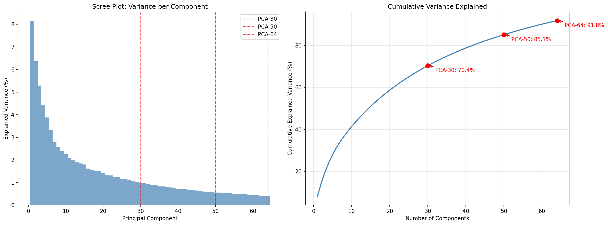
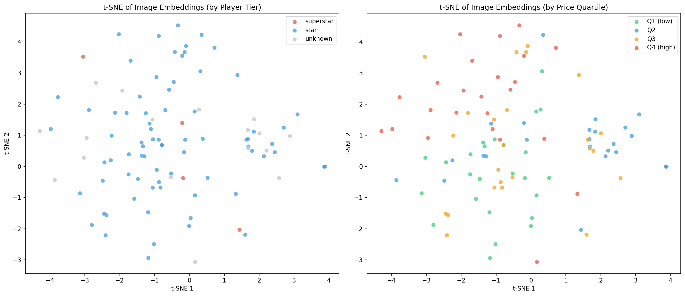
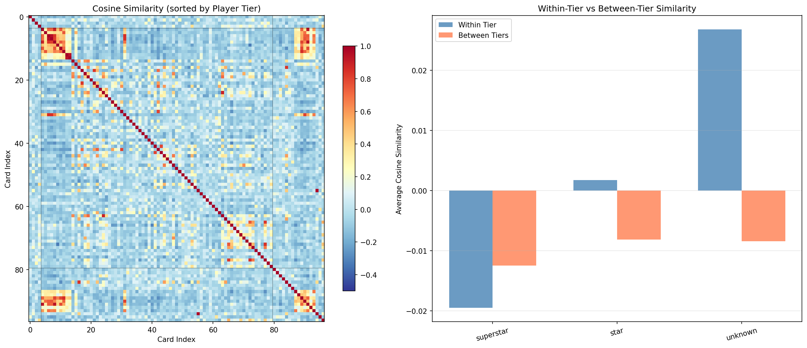

# Session 2: Image Embeddings — Retrospective

## 1. Context & Goal

Session 1 ended with V4-raw at R²=0.35 (24 tabular features). The model had never "seen" the actual card images — all features came from OCR text. Session 2's goal: convert each auction screenshot into a numerical vector (embedding) using a pretrained CNN, to be consumed as additional features in Session 3. **Success criterion: embeddings cluster visually similar cards (verified by inspection).**

**Key realities identified during planning:**
- 97 images total (57 JPG, 40 PNG), two aspect ratios (portrait phone screenshots + landscape tablet screenshots)
- Images are full auction screenshots — card photo occupies roughly the top 30-40%, rest is UI/text/pricing
- With only 97 samples, PCA component count is constrained: max 96 (= n_samples - 1), and adding too many creates overfitting risk when combined with 24 existing tabular features
- torch/torchvision already installed in venv — no dependency changes needed

---

## 2. Plan (What Was Intended)

### Files Created
| # | File | Purpose |
|---|------|---------|
| 1 | `data/extract_image_embeddings.py` | Data pipeline: images → ResNet50 → PCA → CSVs |
| 2 | `analysis/verify_embeddings.py` | Verification: PCA variance, t-SNE, cosine similarity, nearest neighbors |
| 3 | `CLAUDE.md` | Updated with new commands + Stage 2.5 architecture |

### Pipeline Design
- Pretrained ResNet50 (frozen, ImageNet weights) → 2048-d avgpool vectors
- StandardScaler + PCA reduction to three variants: 30, 50, 64 components
- Three output CSVs for Session 3 overfitting comparison

### Verification Suite (separated from pipeline)
- PCA variance analysis: scree plot + cumulative variance curve
- t-SNE: 2D scatter by player tier + price quartile
- Cosine similarity heatmap sorted by tier + within/between tier bar chart
- Nearest neighbor analysis: top-3 neighbors per tier sample

---

## 3. Execution Steps Taken

### Step 1: Created `data/extract_image_embeddings.py`
- ResNet50 with `IMAGENET1K_V2` weights, classification head removed
- Standard ImageNet preprocessing: `Resize(256)` → `CenterCrop(224)` → normalize
- Sequential processing (no batching — unnecessary for 97 images)
- PCA fit once at 64 components, sliced for 30 and 50 variants
- Saved `pca_explained_variance_ratio.npy` for verification script

### Step 2: Created `analysis/verify_embeddings.py`
- Four verification functions, all reading from saved embedding CSVs
- **Bug caught:** initial version re-ran PCA on the already-reduced 64-d data, giving misleading 100% variance at 64 components. Fixed by loading saved variance ratios from the original 2048→64 reduction.

### Step 3: Ran pipeline
- All 97 images processed, 0 errors
- First run downloaded ResNet50 weights (~97MB) to `~/.cache/torch/hub/checkpoints/`
- Extraction took ~2 minutes on CPU

### Step 4: Ran verification
- All 3 plots generated successfully
- Nearest neighbor analysis printed to console

### Step 5: Updated `CLAUDE.md`
- Added extraction + verification commands
- Added Stage 2.5 architecture description

---

## 4. Key Results

### PCA Variance Retained

| Variant | Components | Cumulative Variance | Total Features (with 24 tabular) |
|---------|-----------|--------------------|---------------------------------|
| PCA-30 | 30 | 70.4% | 54 |
| PCA-50 | 50 | 85.1% | 74 |
| PCA-64 | 64 | 91.8% | 88 |

The scree plot shows a classic elbow around component 10-15, with diminishing returns after 30.

### t-SNE Observations
- **By player tier:** No strong tier-based clustering. Expected — player tier is a market concept, not a visual one. A Stephen Curry card doesn't look fundamentally different from a Ja Morant card to a CNN.
- **By price quartile:** Q4 (expensive) cards show slight upper-region tendency but mixed overall. Visual features alone don't cleanly separate price tiers.

### Cosine Similarity
- Heatmap shows clear bright-red clusters — groups of visually similar cards (likely same-player batches)
- Within-tier vs between-tier differences very small (~0.01-0.03). Again expected: visual similarity ≠ market tier.

### Nearest Neighbor Analysis (strongest signal)
- **Ja Morant** cards found each other with 0.948, 0.850, 0.813 similarity — embeddings strongly capture same-player visual identity
- An **"unknown" card** (OCR failed to identify player) matched Ja Morant at 0.936 — the embedding correctly recognized the player visually even when text extraction failed
- **Stephen Curry** had low neighbor similarity (0.194) — his cards span more visually diverse series/designs

### Generated Artifacts
- `output/image_embeddings_pca30.csv` — 97 rows × 31 cols
- `output/image_embeddings_pca50.csv` — 97 rows × 51 cols
- `output/image_embeddings_pca64.csv` — 97 rows × 65 cols
- `output/pca_explained_variance_ratio.npy` — saved variance ratios for verification
- `output/pca_variance_analysis.png` — scree plot + cumulative variance curve
- `output/image_embedding_tsne.png` — t-SNE by player tier + price quartile
- `output/image_similarity_analysis.png` — cosine similarity heatmap + tier comparison

---

## 5. Gaps & Known Limitations

| Gap | Impact | Status |
|-----|--------|--------|
| Price visible in screenshots | Embedding may encode price UI elements, causing data leakage | Known risk — see "Price Leakage" below |
| Full screenshot vs card-only crop | Embedding includes UI chrome, not just card photo | UI elements are repetitive → PCA suppresses them, but some noise remains |
| Only 3 of 5 player tiers represented | Cosine similarity analysis only covers superstar, star, unknown | Starter/rotation tiers have <2 samples each |
| No starter/rotation tier samples | Cannot verify embedding quality for these tiers | Need more data diversity |

### Price Leakage Concern
The auction screenshots show the sale price in the UI. ResNet50 is not an OCR model (trained on ImageNet), so it's poor at reading digits. However, rough visual cues — number of digits, UI styling for premium listings — could leak weak price signal. The Q4 clustering observed in t-SNE could be either legitimate visual signal (patches, refractors look expensive) or leakage. **Mitigation for Session 3:** if embedding-only models predict price unreasonably well, consider cropping to card-only region before extraction.

---

## 6. Concepts Covered

### What Is an Image Embedding?

An embedding is a dense vector of continuous numbers that represents an image in a way machine learning models can consume. We used a pretrained ResNet50 (trained on millions of ImageNet photos) as a feature extractor: feed an image in, chop off the final classification layer, and take the 2048-number output from the average pooling layer. Each number encodes some learned visual concept — texture, shape, color pattern — that the network discovered during its ImageNet training. Unlike one-hot encoding (sparse, discrete, one column per category), embeddings are dense and continuous: every card gets a unique combination of 2048 real-valued numbers.

### PCA: Why Reduce and How Many Components?

PCA (Principal Component Analysis) finds the directions of maximum variance in data and projects onto a smaller subspace. Two key constraints govern component selection:

**Mathematical constraint:** With *n* samples, PCA can extract at most *n-1* meaningful directions. Our 97 images can yield at most 96 components from the 2048-d space, because 97 data points can only define 96 linearly independent directions after centering (subtracting the mean). Requesting more components than this is mathematically impossible.

**Overfitting constraint:** This is the practical concern for Session 3. More PCA components means more features for the downstream model. With 97 training samples and 24 existing tabular features, adding 64 embedding dimensions gives 88 total features — dangerously close to the sample count. The extreme analogy: giving each of 97 cards a unique ID number as a feature would let XGBoost memorize every card perfectly (R²=1.0 on training data) while learning nothing generalizable. More features relative to samples gives the model more "knobs to turn" to fit noise rather than signal. We saved three variants (30, 50, 64) specifically to measure this tradeoff empirically in Session 3.

### StandardScaler Before PCA

We apply StandardScaler (zero mean, unit variance per feature) before PCA. This is critical because ResNet50's 2048 avgpool features have different magnitudes across channels. Without scaling, PCA would be dominated by high-magnitude channels regardless of their discriminative value. Scaling ensures PCA finds directions of maximum *relative* variation, not just maximum *absolute* magnitude.

---

## 7. Recommendations for Session 3

1. **Start with PCA-30** as baseline (most conservative, 54 total features), then compare PCA-50 and PCA-64 to observe the overfitting curve
2. **Watch for price leakage** — if embedding-only model (no tabular features) achieves suspiciously high R², the embeddings may be reading the price from the screenshot
3. **Consider card-region cropping** if leakage is confirmed — crop to upper 40% of portrait images before embedding extraction
4. **LightGBM and CatBoost** may handle the high feature count better than XGBoost due to different regularization strategies
5. **Feature importance analysis** on embedding dimensions — if a few `emb_*` columns dominate, investigate what visual patterns they encode
